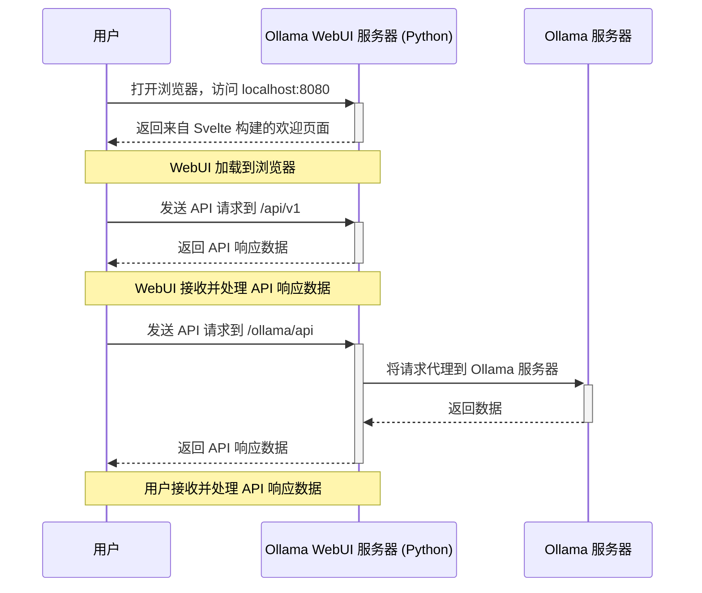
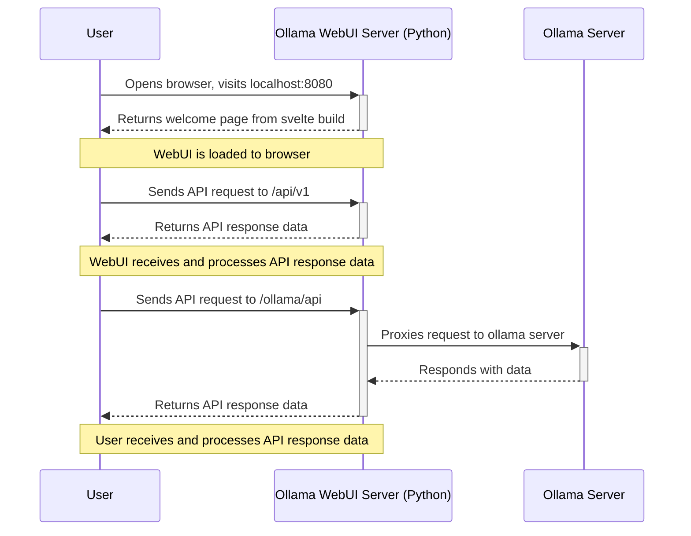

# 中文

```mermaid
sequenceDiagram
participant User as 用户
participant Ollama_UI_Server as Ollama WebUI 服务器 (Python)
participant Ollama_Server as Ollama 服务器

User->>+Ollama_UI_Server: 打开浏览器，访问 localhost:8080
Ollama_UI_Server-->>-User: 返回来自 Svelte 构建的欢迎页面
Note over User, Ollama_UI_Server: WebUI 加载到浏览器
User->>+Ollama_UI_Server: 发送 API 请求到 /api/v1
Ollama_UI_Server-->>-User: 返回 API 响应数据
Note over User, Ollama_UI_Server: WebUI 接收并处理 API 响应数据
User->>+Ollama_UI_Server: 发送 API 请求到 /ollama/api
Ollama_UI_Server->>+Ollama_Server: 将请求代理到 Ollama 服务器
Ollama_Server-->>-Ollama_UI_Server: 返回数据
Ollama_UI_Server-->>-User: 返回 API 响应数据
Note over User, Ollama_UI_Server: 用户接收并处理 API 响应数据
```

# 英文

```mermaid
sequenceDiagram
participant User as User
participant Ollama_UI_Server as Ollama WebUI Server (Python)
participant Ollama_Server as Ollama Server

User->>+Ollama_UI_Server: Opens browser, visits localhost:8080
Ollama_UI_Server-->>-User: Returns welcome page from svelte build
Note over User, Ollama_UI_Server: WebUI is loaded to browser
User->>+Ollama_UI_Server: Sends API request to /api/v1
Ollama_UI_Server-->>-User: Returns API response data
Note over User, Ollama_UI_Server: WebUI receives and processes API response data
User->>+Ollama_UI_Server: Sends API request to /ollama/api
Ollama_UI_Server->>+Ollama_Server: Proxies request to ollama server
Ollama_Server-->>-Ollama_UI_Server: Responds with data
Ollama_UI_Server-->>-User: Returns API response data
Note over User, Ollama_UI_Server: User receives and processes API response data
```
